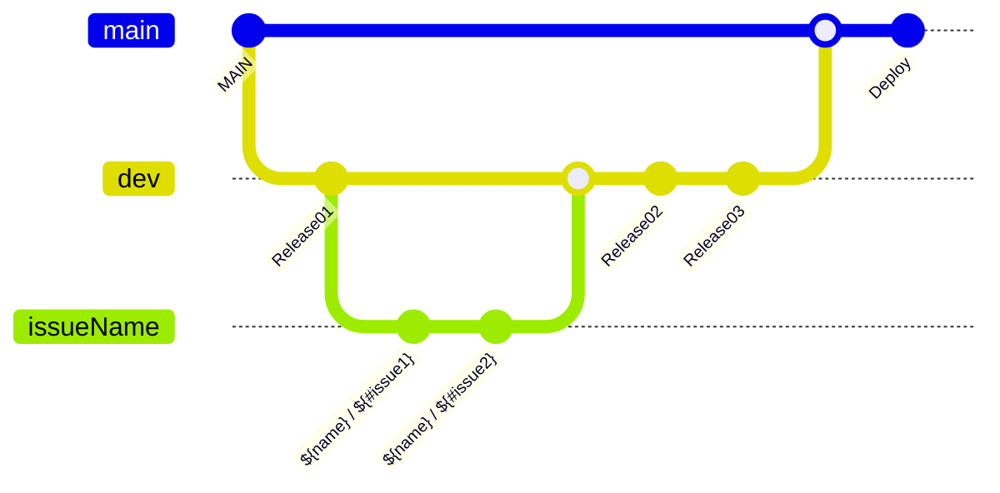

# SYM
Speak Your Mind, 모공 프로젝트

<br>

## 프로젝트 소개
>SYM은 현대 생활의 복잡함에서 벗어나 여러분이 자신을 돌아보고 감정, 생각을 명확하게 기록할 수 있도록 도와주는 감정일기 앱입니다!
>감정일기를 통해 나의 감정을 정확히 인식하여 자존감을 향상시키고, 더 나아가 사회성을 높일 수 있습니다~!
>또 캐릭터를 통해 사용자에게 공감과 위로를 얻을 수 있습니다. SYM을 통해 기록하는 즐거움을 느껴보세요!

<br>

### 👀 주요기능
- **`로그인`** : 카카오,애플 로그인으로 간편하게 로그인 할 수 있습니다.
- **`메인`** : 캘린더를 통해 쉽게 기록 일정을 확인할 수 있습니다.
- **`기록하기`** : 사건,생각,감정,행동을 기록하고 캐릭터를 통해 공감과 위로를 얻을 수 있습니다.
- **`기록보기`** : 선택한 날짜의 내가 기록한 감정기록을 볼 수 있고 기록 수정을 할 수 있습니다.
- **`마이페이지`** : 내가 쓴 기록갯수를 볼 수있고 닉네임 변경, 로그아웃, 회원탈퇴를 할 수 있습니다.

<br>

### 📱구동화면
|**`로그인`**|**`캘린더`**|**`기록하기`**|**`기록보기`**|**`마이페이지`**|
|-------|-------|-------|-------|-------|
|||| ||

<br>


### 🛠️ 개발 환경, 도구 및 활용한 기술

```
- 개발 언어 : Swift
- 개발 환경 : SwiftUI
    - 최소 iOS 16.4
    - iPhone SE ~ iPhone 15 Pro 호환
- 디자인 툴 : Figma
- 협업 도구 : Github, Team Notion
- 활용한 기술
    - Xcode, Tuist, SwiftLint
    - MVVM, POP, Clean Architecture
    - Combine, CoreData, URLSession
    - FireStore
```


<br>

### 🗃️ 컨벤션 및 깃플로우 전략
#### 폴더 컨벤션

```
📦SYM
    ├──🗂️Tuist
    ├──🗂️Project
    │   ├──🗂️KaKaoSPM
    │   ├──🗂️FirebaseSPM
    │   ├──🗂️App
    │   │   ├──🗂️Resources
    │   │   ├──🗂️Sources
    │   │   │   ├──🗂️Data
    │   │   │   │   ├── Repositories
    │   │   │   │   ├── Network
    │   │   │   │──🗂️DesignSystem
    │   │   │   │──🗂️Domain
    │   │   │   │   ├── Entities
    │   │   │   │   ├── UseCases
    │   │   │   │──🗂️Extensions
    │   │   │   │──🗂️Model
    │   │   │   │──🗂️Protocol
    │   │   │   │──🗂️Services   
    │   │   │   │   ├── ChatGPT 
    │   │   │   │   ├── CoreData    
    │   │   │   │   ├── Firebase       
    │   │   │   ├──🗂️Presentation
    │   │   │   │   ├── Authencation
    │   │   │   │   ├── Calendar
    │   │   │   │   ├── CustomView
    │   │   │   │   ├── Login
    │   │   │   │   ├── MyPage
    │   │   │   │   ├── Record
    │   │   │   │   ├── Tab
    │   │   │   ├── 🗂️Util
    └───────────────│
```
<br>

#### 깃플로우 전략


<br>


## 팀원 소개
<div align="left">  

### 👩🏻‍💼 PM
| [박혜연]<br/> [@hye-y](https://github.com/hye-y)<br/> |
| :---: |
|  |

### 👩🏻‍🎨 Designer
| [한지수]<br/> [@잔디밭](https://m.blog.naver.com/hhhjs-?tab=1)<br/> |
| :---: |
|  |

### 🧑🏻‍💻 Developer
| [박서연]<br/> [@syss220211](https://github.com/syss220211)<br/> | [조민근]<br/> [@syss220211](https://github.com/syss220211)<br/>  | [안지영]<br/> [@yyomzzi](https://github.com/yyomzzi)<br/>  | [전민석]<br/> [@a-jb97](https://github.com/a-jb97)<br/> | [변상필]<br/> [@OzDevelop](https://github.com/OzDevelop)<br/>  |
| :---: | :---: | :---: | :---: | :---: |
|  |  |  |   |  |

</div>
 

<br>

## 📄 License
### “SYM" is available under the MIT license. See the [LICENSE](https://github.com/Good-MoGong/SYM/blob/dev/LICENSE) file for more info.
- Tuist
- Firebase - iOS
